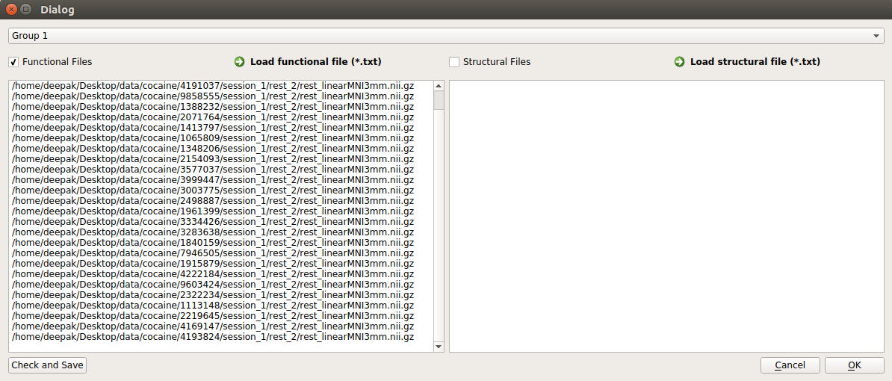

# Main Window 
Here&rsquo;s the main window again.

I shall explain all the fields in order.

* **Analysis Name**: Please put any custom name for the analysis that you want to do. A directory of this name will be made where all the results and intermediate files will be stored.
* **Reference**: This field will contain the standard brain in MNI or in any other format on which all the results will be referenced. It should be zipped nii format.
* **Preprocessing**: Select the radiobutton which suits best to your analysis. If the data is not processed, choose the 1st; in case it has already been processed but not using FSL, choose the 2nd, otherwise if FSL is used, feat folders should be provided.
* **Groups**: Choose the number of groups or comparisons that you want to do in your analysis and then, by clicking on **Choose 4-D data**, please enter the paths to your files of the various groups. 
* **Output Directory**: Here, you can change the place where your output directory is to be made. The FileDialog opens by clicking on the arrow.
* **Save Files**: Please check the tick boxes if you want to save preprocessing or correlation files. If the analysis is to be repeated in the same folder and the intermediate files are already present, it saves a lot of time by not repeating the same steps.
* **Repetition Time**: Enter the repetition time for the functional files. The units are in seconds.
* **ROI File**: The ROI file should be a zipped nii file containing the brain numbered from 1 to N, where N represents the number of ROIs in brain. It should be registered to the standard image. All the voxels outside the brain should be numbered 0.
* **FSL Directory**: It gets automatically filled if FSL is found in the exact location given here. Otherwise, please specify the location for FSL in the computer.
* **Mask for Brain**: In case a common mask is to be applied to all the functional files provided, please specify it here. Otherwise, this field can be kept empty.
* **Threads**: Specify the number of threads or number of files that you want to process at a time. Please choose it according to your computer&rsquo;s configurations.
* **Correlations File**: Please specify the correlations file here if only the statistics are to be done. Otherwise, please keep this field empty.

The window for choosing the 4-D data looks like this.

You can choose the group number from the upper dropdown bar. Now, you can either load a text file containing functional files paths or input them in the window itself with every line corresponding to one file. Once you are done, tick the checkbox (Functional Files/ Structural Files) and then click on **Check and Save**. After loading the files for all the groups, exit the window by clicking on "Okay". If a warning appears, you might have missed something or put a wrong address. The wrong address will get displayed. 